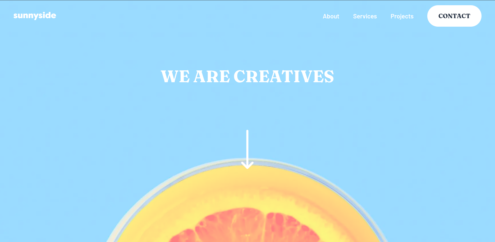

# Frontend Mentor — Sunnyside agency landing page

Solution for the [Sunnyside agency landing page challenge](https://www.frontendmentor.io/challenges/agency-landing-page-7yVs3B6ef) on [Frontend Mentor](https://www.frontendmentor.io). This app implements the desktop/mobile layouts, copy, and imagery from the brief using the official style guide (colors, typography, spacing targets).

## Table of contents

- [Overview](#overview)
  - [The challenge](#the-challenge)
  - [Screenshot](#screenshot)
  - [Links](#links)
- [Local setup](#local-setup)
  - [Prerequisites](#prerequisites)
  - [Install and run](#install-and-run)
  - [Scripts](#scripts)
- [My process](#my-process)
  - [Built with](#built-with)
  - [What I learned](#what-i-learned)
  - [Continued development](#continued-development)
  - [Useful resources](#useful-resources)
  - [AI collaboration](#ai-collaboration)
- [Author](#author)
- [Acknowledgments](#acknowledgments)

## Overview

### The challenge

Users should be able to:

- View the optimal layout for the site depending on their device’s screen size
- See hover states for all interactive elements on the page

The page includes a full-viewport hero (“We are creatives”), alternating text/image sections (including Graphic design & Photography), a four-image gallery, client testimonials with quotes, and a footer with navigation and social links—aligned with the Frontend Mentor content order and `style-guide.md` where applicable.

### Screenshot



### Links

- Solution URL: _[submit on Frontend Mentor, then paste your solution page here]_
- Live site URL: _[your deployed URL, e.g. Vercel / Netlify]_

---

## Local setup

### Prerequisites

- [Node.js](https://nodejs.org/) **18.18+** (LTS recommended)
- [pnpm](https://pnpm.io/installation) (this repo uses `pnpm`; npm/yarn work if you swap the commands)

### Install and run

From the **repository root**:

```bash
cd sunny-agency
pnpm install
```

Development server (default [http://localhost:3000](http://localhost:3000)):

```bash
pnpm dev
```

Production build and local preview:

```bash
pnpm build
pnpm start
```

Lint:

```bash
pnpm lint
```

### Scripts

| Command       | Description                           |
| ------------- | ------------------------------------- |
| `pnpm dev`    | Dev server with hot reload (Turbopack) |
| `pnpm build`  | Optimized production build            |
| `pnpm start`  | Run the production build locally      |
| `pnpm lint`   | ESLint (Next.js config)               |

---

## My process

### Built with

- **Next.js 16** (App Router) and **React 19** with **TypeScript**
- **Tailwind CSS v4** (`@import "tailwindcss"`) plus component styles and design tokens in `app/globals.css`
- **Design tokens** — CSS variables such as `--sunny-red-400`, `--sunny-yellow-500`, `--sunny-green-800`, etc., mirrored into `@theme` for utilities like `text-green-800` and `bg-green-500`
- **Typography** — [Barlow](https://fonts.google.com/specimen/Barlow) (body) and [Fraunces](https://fonts.google.com/specimen/Fraunces) (headings) via `next/font/google`
- **`next/image`** for responsive images, with `priority` / `sizes` on the LCP hero image where appropriate
- **Layout** — Flexbox and CSS Grid (e.g. testimonial grid, image gallery)
- **Semantic structure** — single `h1` in the hero; section titles as `h2`; testimonial names as `h3` under a “Client testimonials” `h2`

### What I learned

- **Matching assets to URLs** — images live under `public/desktop/`, `public/team/`, etc.; using paths like `/images/desktop/...` caused 404s until they matched the real folders.
- **Flex columns and `min-w-0`** — for 50/50 text/image rows, `md:w-1/2` plus `min-w-0` on both columns stops long text from blowing out the layout (`min-width: auto` on flex items).
- **`next/image` and LCP** — the hero image uses `priority` and sensible `sizes` so the largest above-the-fold image loads eagerly; decorative images stay lazy by default.
- **Heading outline** — keeping one main `h1`, `h2` for each major block, and `h3` for testimonial names keeps the document outline predictable for assistive tech.
- **“Stabilo” / highlighter links** — “Learn more” uses a `::before` bar with `isolation: isolate` and `z-index: -1`, with highlight colors from **`color-mix(..., var(--sunny-…), transparent)`** so tints stay tied to the style guide.
- **Favicons & metadata** — `app/icon.svg`, `favicon.ico`, `apple-icon.png`, and `manifest.ts` integrate with Next’s file conventions; tools like RealFaviconGenerator help validate the setup.
- **Hydration noise in dev** — mismatches on `<body>` attributes (e.g. `cz-shortcut-listen`) often come from **browser extensions**, not React bugs—testing in a clean profile helps.
- **Server vs client components** — most UI is server-rendered; `"use client"` is only needed when using hooks or browser-only APIs (this project keeps client boundaries minimal).

### Continued development

- Finish the **mobile menu** (hamburger) with open/close state and focus trap if not already complete
- Add **focus-visible** styles and double-check **color contrast** on the teal footer and hero overlay
- **Performance pass** — review `sizes` on all `next/image` usages; consider blur placeholders for large photos
- **Tests** — optional Playwright or Vitest smoke tests for key routes
- **Deployment** — connect the repo to Vercel/Netlify and add the live URL to this README

### Useful resources

- [Frontend Mentor — Sunnyside challenge](https://www.frontendmentor.io/challenges/agency-landing-page-7yVs3B6ef)
- [Next.js — Image component](https://nextjs.org/docs/app/api-reference/components/image) and [App Router](https://nextjs.org/docs/app)
- [MDN — Flexbox](https://developer.mozilla.org/en-US/docs/Web/CSS/CSS_flexible_box_layout), [`min-width: min-content` / flex](https://developer.mozilla.org/en-US/docs/Web/CSS/min-width)
- [Tailwind CSS v4](https://tailwindcss.com/docs) — `@theme` and arbitrary properties when needed
- [RealFaviconGenerator — favicon checker](https://realfavicongenerator.net/favicon_checker) (CLI: `pnpm dlx realfavicon check 3000` with the dev server running)

### AI collaboration

I used **Cursor** (and similar AI-assisted editing) to speed up **boilerplate**, **debug** confusing issues (wrong image paths, prop names for testimonial data, `undefined` in `className` strings), **structure** this README, and **reason through** accessibility and layout details. I still **read and adjusted** the code myself—especially tokens in `globals.css`, content in `page.tsx`, and component boundaries—so the solution reflects the real challenge constraints rather than a generic template.

---

## Author

- Website — _[your portfolio or personal site]_
- Frontend Mentor — _[@yourusername](https://www.frontendmentor.io/profile/yourusername)_

_Replace the placeholders above after you publish your solution._

## Acknowledgments

- [Frontend Mentor](https://www.frontendmentor.io) for the challenge brief, design references, and community.
- Everyone who shares write-ups and solutions that helped compare approaches to layout, images, and accessibility.
